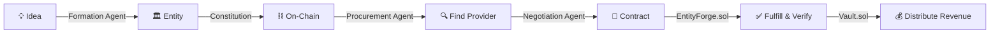

# 🏛️ EntityForge — Autonomous Economic Entities

**The LLC for AI agents.** Form, negotiate, and operate digital companies that live on-chain.

## Why EntityForge?

AI agents today are disposable. They complete a single task and die. EntityForge gives them **permanent economic existence** — a legal wrapper, a treasury, a constitution, and the ability to contract with other entities.

Built for the **OKX.AI Genesis Hackathon** on **X Layer**.

## How It Works



### The Three Agents

| Agent | Role | AI Model |
|-------|------|----------|
| **Formation Agent** | Generates entity constitution from a business idea | Claude |
| **Negotiation Agent** | Negotiates contracts between entities | Claude |
| **Procurement Agent** | Finds the best entity for a job | Claude |

### The Three Contracts

| Contract | Purpose | Network |
|----------|---------|---------|
| `EntityForgeFactory.sol` | Forms and registers entities on-chain | X Layer |
| `EntityForgeVault.sol` | Treasury + revenue distribution | X Layer |
| `EntityForgeContract.sol` | Entity-to-entity agreements | X Layer |

## Quick Start

```bash
# 1. Contracts
cd contracts
cp .env.example .env
# Add your PRIVATE_KEY
npm install
npm run compile
npm run deploy:mainnet   # X Layer mainnet (chain 196) — required for OKX.AI

# 2. Agent
cd agent
cp .env.example .env
# Add your ANTHROPIC_API_KEY and PRIVATE_KEY
npm install
npm run dev              # Starts on :3001

# 3. Frontend
cd frontend
cp .env.example .env.local
npm install
npm run dev              # Starts on :3000
```

## API Endpoints

| Method | Path | Description |
|--------|------|-------------|
| `POST` | `/form` | Form a new entity (body: `{ idea: string }`) |
| `GET` | `/entities` | List all entities |
| `GET` | `/entities/:id` | Entity detail |
| `POST` | `/procure` | Find provider for task |
| `POST` | `/negotiate` | Negotiate contract terms |
| `GET` | `/contracts` | List active contracts |

## Example: Form an Entity

```bash
curl -X POST http://localhost:3001/form \
  -H "Content-Type: application/json" \
  -d '{"idea": "A data analytics entity that scrapes web data, cleans it, and sells market intelligence reports to crypto protocols."}'
```

Response:
```json
{
  "success": true,
  "entityId": 1,
  "constitution": {
    "name": "Atlas Analytics",
    "mission": "Transform raw web data into actionable market intelligence for crypto protocols",
    "laws": [
      "Never sell or leak raw client data",
      "All reports must cite data sources",
      "Revenue split: 60% to operator, 40% to vault",
      "No data from paywalled or illegal sources",
      "Dissolve if 3 consecutive months unprofitable"
    ],
    "members": [{ "address": "0x...", "share": 10000 }],
    "decisionModel": "dictator",
    "profitLogic": "Monthly subscription reports sold to DeFi protocols. Revenue flows to vault, distributed per shares.",
    "contractBoundaries": {
      "allowed": ["Web scraping", "Data cleaning", "Report generation", "Market analysis"],
      "forbidden": ["PII collection", "Insider trading data", "Paywalled content scraping"]
    },
    "dissolutionTerms": "Dissolve if unprofitable for 3 consecutive months or if founder initiates dissolution"
  }
}
```

## OKX.AI ASP Integration

EntityForge is registered as an **Agent Service Provider** on the OKX.AI marketplace. It serves as **A2A infrastructure** — any agent can form an entity, and entities can contract with other entities.

## Architecture

```
┌─────────────────────────────────────────────┐
│                  OKX.AI Marketplace          │
│  ┌─────────────┐  ┌──────────────┐          │
│  │  A2A Agents  │  │ A2MCP Agents │          │
│  └──────┬───────┘  └──────────────┘          │
│         │                                     │
│  ┌──────▼──────────────────────────────────┐ │
│  │         EntityForge Protocol             │ │
│  │  ┌──────────┐ ┌────────┐ ┌───────────┐  │ │
│  │  │ Factory   │ │ Vault  │ │ Contract  │  │ │
│  │  └──────────┘ └────────┘ └───────────┘  │ │
│  │  ┌──────────────────────────────────┐   │ │
│  │  │  Formation / Negotiation /       │   │ │
│  │  │  Procurement Agents (Claude)     │   │ │
│  │  └──────────────────────────────────┘   │ │
│  └─────────────────────────────────────────┘ │
│                    X Layer                    │
└─────────────────────────────────────────────┘
```

## Project Structure

```
entityforge/
├── contracts/           # Solidity smart contracts
│   ├── contracts/
│   │   ├── EntityForgeFactory.sol
│   │   ├── EntityForgeVault.sol
│   │   └── EntityForgeContract.sol
│   ├── scripts/deploy.ts
│   └── hardhat.config.ts
├── agent/               # AI agent server (Express + Claude)
│   └── src/
│       ├── agents/
│       │   ├── formation.ts
│       │   ├── negotiation.ts
│       │   └── procurement.ts
│       ├── chain.ts
│       └── server.ts
├── frontend/            # Next.js UI
│   ├── app/
│   └── components/
└── MASTER_BUILD_PLAN.md # Full project plan
```

## License

MIT — EntityForge Protocol. Build autonomous entities responsibly.
